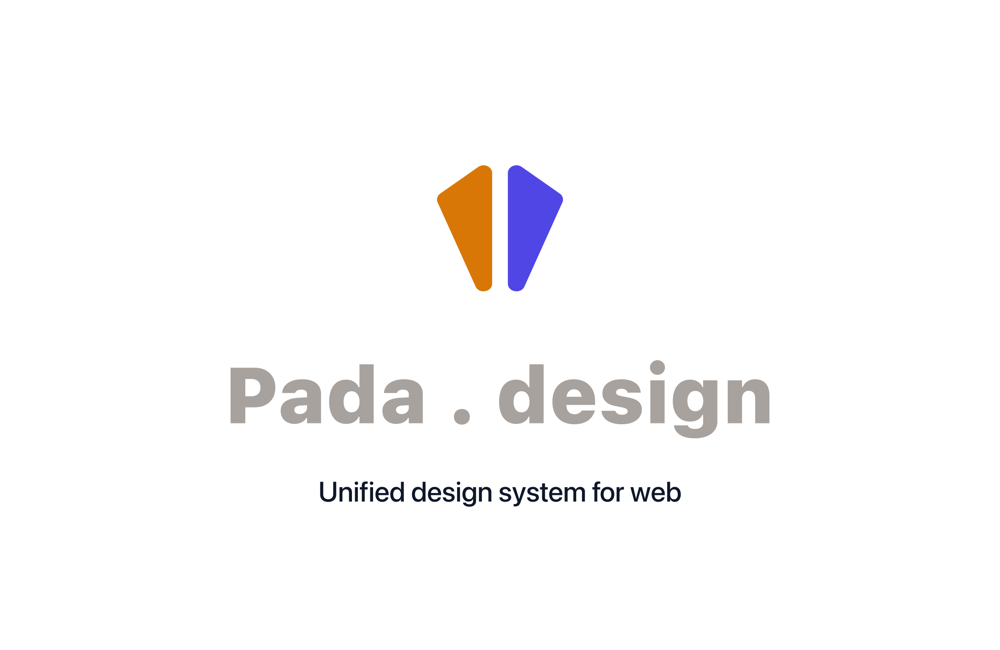

# Pada Design System



This is a React design system built with Vite. It includes a set of reusable components and a demo application to showcase them.

[Visit Pada.design to learn more](https://supreeth-kashyap.notion.site/Pada-Design-System-2c6a6474ca5a80cea166ed78587299a2)

## Figma design file

Avail the Figma file of the design system in the community for free

[Figma file](https://www.figma.com/community/file/1619638623779328209)


## Installation

To install the design system, run:

```bash
npm install pada
```

## Usage

To start the development server, run:

```bash
npm run dev
```

This will open the demo application in your browser.

## Components

This design system includes the following components:

- **Accordion**: Collapsible sections to show/hide content.
- **Banner**: Notices and important messages display.
- **Button**: Clickable control for primary actions.
- **Card**: Container for grouped related content.
- **Carousel**: Scrollable content carousel with controls.
- **Checkbox**: Binary selection with label support.
- **CodeSnippet**: Display formatted, copyable code blocks.
- **ComboBox**: Filterable list dropdown with options.
- **DatePicker**: Select dates via calendar UI.
- **FormLabel**: Accessible labels for form fields.
- **Icon**: Reusable SVG icons for UI.
- **Indexer**: Alphabetical index navigation component.
- **InputDate**: Single-line date input field.
- **InputText**: Single-line text input field.
- **InputTextArea**: Multi-line text input area.
- **KeyValue**: Render key/value metadata pairs.
- **List**: Generic list rendering component.
- **Loader**: Indicate loading state visually.
- **Logo**: Project or brand logo component.
- **Modal**: Overlay dialog for focused tasks.
- **Notification**: Transient alert messages and toasts.
- **PageHeader**: Page title and actions area.
- **Pills**: Compact, selectable pill-style buttons.
- **Popover**: Floating container for contextual content.
- **Progress**: Visual progress indicators for tasks.
- **RadioGroup**: Grouped single-choice radio buttons.
- **SearchField**: Text search input with clear.
- **SegmentControl**: Segmented button toggle control.
- **Select**: Dropdown selection with ComboBox.
- **SideDrawer**: Slide-in side panel for navigation.
- **Sidebar**: Fixed side navigation area.
- **Slider**: Range selection slider control.
- **Steps**: Multi-step progress indicator component.
- **Switch**: Toggle between on/off states.
- **Table**: Responsive tabular data display component.
- **Tabs**: Tabbed navigation interface component.
- **Tags**: Compact label tags for metadata.
- **Text**: Typography primitives and helpers.
- **Toolbar**: Action toolbar with controls.
- **Tooltip**: Hover tooltip for extra info.
- **UploadField**: File upload field with progress.

### Examples

Here are some examples of how to use the components:

```jsx
import React from 'react';
import { Button } from 'pada/components/Button';
import { Input } from 'pada/components/Input';

const App = () => (
  <div>
    <Button>Click me</Button>
    <Input label="Name" placeholder="Enter your name" />
  </div>
);
```
